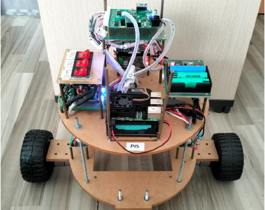
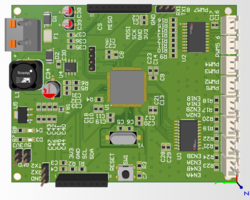
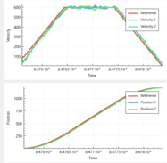
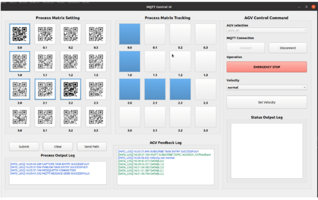
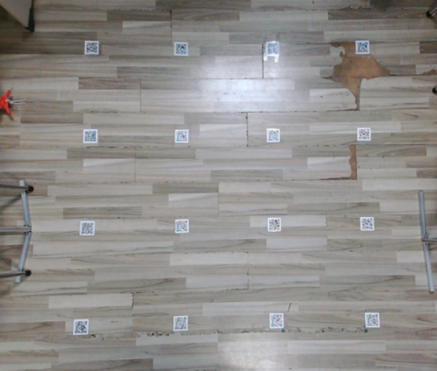
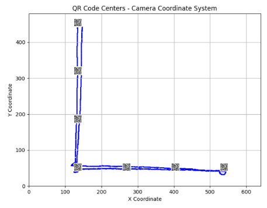

# AGV QR Code

### This repository shows how my undergraduate thesis project, a QR-code-based AGV, works through images and videos.

The thesis designs a solution using a QR code matrix set up to navigate and locate an AGV. The AGV will follow a trajectory defined by the user, with specified start and end points

### Hardware Design

The robot is equipped with a downward-facing camera to detect QR codes on the ground. A Raspberry Pi runs ROS, processes camera images, and communicates with an external GUI. It also sends motion commands via UART to a custom-designed STM32 control board. The STM32 board handles low-level control, including PID speed control of the two DC motors through a custom-designed H-bridge circuit.

Robot:

Self-Designed Microcontroller board:

### PID Controller and Wheel-Speed Control

To execute the commanded robot motion within the QR-code grid, PID controllers are applied to the two drive motors for wheel-speed tracking. The low-level controller regulates the left and right wheel velocities so that the robot can accurately follow the reference linear and angular velocities generated by the motion planner and tracking controller.

PID wheel-speed control results:

### Robot Localization
An EKF is used to fuse wheel odometry, IMU data, and absolute robot pose measurements obtained from QR codes placed on the floor.

### Path Planning and Tracking

To ensure reliable operation on the QR-code grid, the robot is constrained to move only along straight segments and to perform in-place rotations when a change in heading is required. During each translational segment, the path-tracking controller generates the nominal linear velocity reference $v_{\mathrm{trap}}$ based on a trapezoidal motion profile. A feedback law is then used to compensate for longitudinal and heading errors while keeping the robot on the straight-line segment toward the target.

For a straight segment from the start point $P_0=(x_0,y_0)$ to the goal point $P_g=(x_g,y_g)$, the unit direction vector is defined as

$$
\mathbf{u} = \frac{1}{L}
\begin{bmatrix}
x_g-x_0\\
y_g-y_0
\end{bmatrix},
\qquad
L=\sqrt{(x_g-x_0)^2+(y_g-y_0)^2}.
$$

The normal vector of the segment is

$$
\mathbf{n} =
\begin{bmatrix}
-u_y\\
u_x
\end{bmatrix}.
$$

Given the current robot position $P=(x,y)$, the longitudinal progress and lateral deviation are computed as

$$
s_{\mathrm{meas}} = \mathbf{u}^\top
\begin{bmatrix}
x-x_0\\
y-y_0
\end{bmatrix},
\qquad
e_n = \mathbf{n}^\top
\begin{bmatrix}
x-x_0\\
y-y_0
\end{bmatrix}.
$$

Let $s_{\mathrm{ref}}$ be the reference progress generated by the trapezoidal profile. The longitudinal tracking error is

$$
e_s = s_{\mathrm{ref}} - s_{\mathrm{meas}}.
$$

The heading error is computed with respect to the line direction,

$$
\theta_{\mathrm{path}} = \mathrm{atan2}(y_g-y_0,\;x_g-x_0),
\qquad
e_\theta = \mathrm{wrapToPi}(\theta_{\mathrm{path}}-\theta),
$$

where $\theta$ is the current robot heading.

The commanded linear velocity is defined as

$$
v = \max\!\left(
v_{\min},
\left(v_{\mathrm{trap}} + K_s e_s + K_i \int e_s\,dt\right)
\cos(e_\theta)\frac{1}{1+k_n|e_n|}
\right),
$$

which means that the robot follows the trapezoidal velocity profile while correcting longitudinal error. The forward speed is reduced when the heading error or lateral deviation becomes large, preventing the robot from moving aggressively in the wrong direction.

The angular velocity is defined as

$$
\omega = K_\theta e_\theta + K_n e_n,
$$

so that when the robot deviates from the desired straight-line path, the angular velocity gradually steers it back toward the reference segment. If the deviation becomes too large, steering by angular correction alone is no longer sufficient; in that case, the controller prioritizes heading recovery before resuming nominal forward tracking.

### GUI:
The GUI interface is programmed using Qt, communicating with the robot through the MQTT protocol. It sends the movement trajectory between two endpoints set by the user, notifies when the vehicle reaches the QR codes in the matrix, and adjusts the vehicle's speed.

#### Go to goal process: 
Frames from Camera             |  Image processing with Optical Flow algorithm
:-------------------------:|:-------------------------:
  | 

### Test environment :
The QR code matrix is arranged on the floor, and a camera positioned above looks down to observe during the movement process to evaluate the results

QR code matrix:

### Result Video:

Result:

